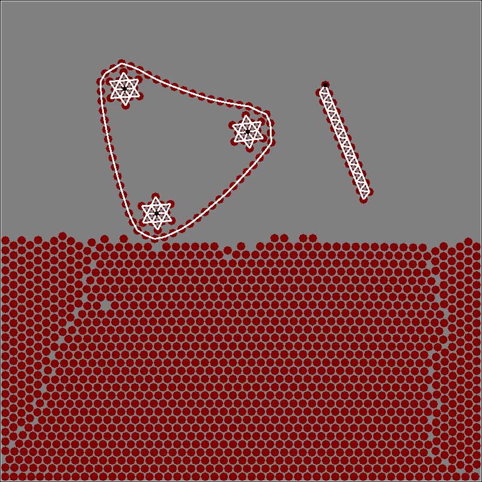
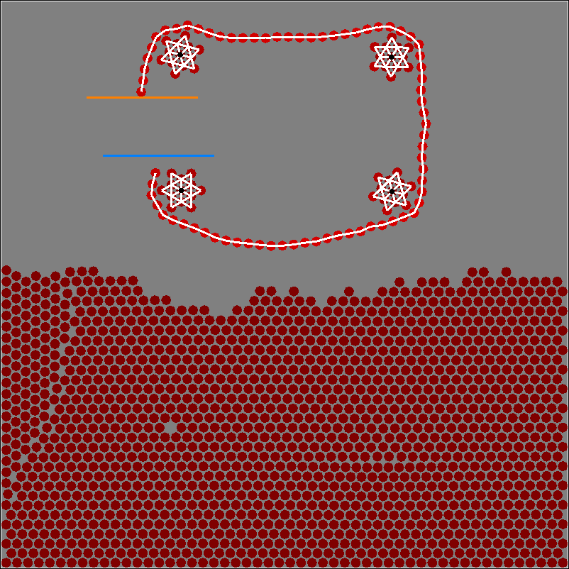

# ptoy





## Clone

    git clone https://github.com/pkarnakov/ptoy.git

## Requirements

- Linux or Mac OS X
- CMake
- SDL2

## Build

```
mkdir -p build
cd build
cmake ..
make -j4
```

## Run

```
build/ptoy
```

## Controls

### Keyboard

* `r`: switch mouse to *Repulsion* mode
* `a`: switch mouse to *Attraction* mode
* `p`: switch mouse to *Pick* mode
* `o`: switch mouse to *Portal* mode
* `f`: switch mouse to *Freeze* mode
* `b`: switch mouse to *Bonds* mode
* `n`: switch mouse to *No action* mode
* `g`: toggle gravity
* `i`: remove last pair of portals
* `q`: quit after pressing 3 times

### Mouse

Click actions depend on the mode selected by keyboard,
all mouse buttons are equivalent.

Mode|Key|Click action
:---|:---:|---
*Repulsion* (default) |`r`| repulsive force
*Attraction* |`a`| attractive force
*Portal*  |`o`| draw portals (blue, then orange)
*Pick*  |`p`| pick the closest particle
*Freeze* |`f`| freeze/unfreeze particle
*Bonds*  |`b`| draw bonds between particles
*No action* |`n`| nothing
